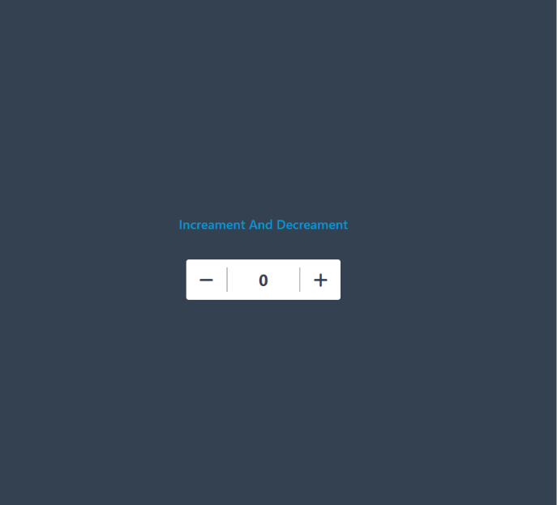

# 🔢 Counter App

A simple and interactive Counter App built using HTML, JavaScript, and Tailwind CSS. Users can increase and decrease the counter value through an easy-to-use interface.

## 🚀 Live Demo

https://yadavsawan4062-hub.github.io/CounterApp/

## 📸 Screenshot



## ✨ Features

* Increment Counter
* Decrement Counter
* Real-time Counter Update
* Responsive User Interface
* Beginner-Friendly JavaScript Project

## 🛠️ Technologies Used

* HTML5
* JavaScript
* Tailwind CSS

## 📂 Project Structure

```text
CounterApp/
│
├── index.html
└── script.js
```

## 💻 How to Run

1. Clone the repository

```bash
git clone https://github.com/yadavsawan4062-hub/CounterApp.git
```

2. Open the project folder

```bash
cd CounterApp
```

3. Open `index.html` in your browser

## 👨‍💻 Author

**Sawan Yadav**

GitHub: https://github.com/yadavsawan4062-hub
